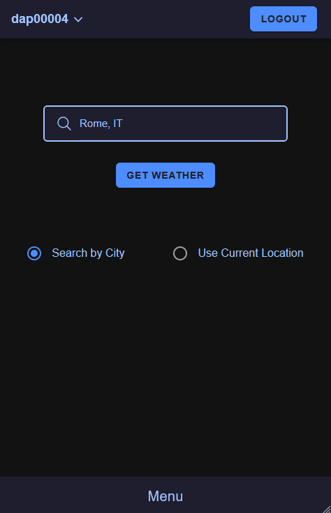
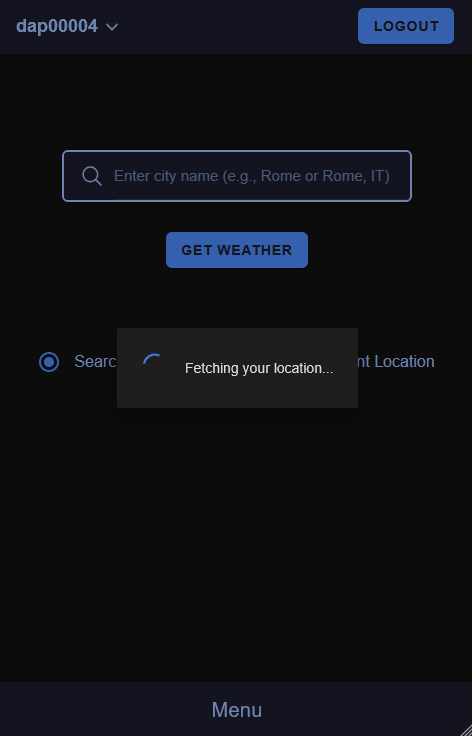
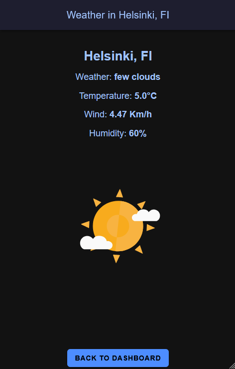

# My Weather App ☁️

**My Weather App** is a **cross-platform mobile application** built with **Ionic React** and **Firebase**.
Users can **register**, **log in**, check **real-time weather** by **city** or using **GPS location**, view their **search history**, and are **automatically logged out after 10 minutes of inactivity**.
The app leverages **Firebase Authentication** and **Firestore** to securely manage user data, and offers a clean and interactive UI powered by **React**, **Redux**, and **Toastify** notifications.

> 📱 **Second school Ionic project** — focused on mobile development, Firebase integration, and state management with Redux.
><br>
><br>
><br>
>Author: **Daniel Pozzoli**

---

<br>
<br>

## Table of Contents
- [Table of Contents](#table-of-contents)
- [🚀 Features](#-features)
- [Screenshots](#screenshots)
  - [Searching city by name:](#searching-city-by-name)
  - [The app allows getting weather info by using GPS coordinates:](#the-app-allows-getting-weather-info-by-using-gps-coordinates)
- [Tech Stack](#tech-stack)
- [🧩 Technologies Used](#-technologies-used)
- [📦 Installation \& Setup](#-installation--setup)
- [▶️ Run the App Locally](#️-run-the-app-locally)
- [🌐 Live Demo](#-live-demo)
- [🧪 Test User Credentials](#-test-user-credentials)
- [🧼 Account Management](#-account-management)
- [💭 Final Thoughts](#-final-thoughts)

<br>


## 🚀 Features
- 🔐 **User Authentication** (Register / Login)
- 📍 **Weather Search by City or GPS Location**
- 🕓 **Search History** saved per user (stored in Firestore)
- ⏱️ **Auto Logout** after 10 minutes of inactivity (even if app is idle)
- 🗑️ **Account Deletion** with user confirmation
- 📊 **Redux** for state management (user info, search type, history)
- 📋 **Form Validation & Alerts**
- 🧼 Clean UI with custom theme
- ☁️ **Weather animations** for dynamic feedback
- 📦 Hosted on **Netlify** for easy access

<br>

## Screenshots
### Searching city by name:
| Step 1: Entering City | Step 2: Results Page |
|:--:|:--:|
|  |  |

<br>

### The app allows getting weather info by using GPS coordinates:
| Step 1: Selecting gps | Step 2: Results Page |
|:--:|:--:|
|  |  |

<br>

## Tech Stack
- [Ionic React](https://ionicframework.com/docs/react)
- [Firebase (Auth + Firestore)](https://firebase.google.com/)
- [Redux Toolkit](https://redux-toolkit.js.org/)
- [React Router](https://reactrouter.com/)
- [React Toastify](https://fkhadra.github.io/react-toastify/)
- [TypeScript](https://www.typescriptlang.org/)

  
<br>

## 🧩 Technologies Used
- **Ionic React**
- **Firebase (Auth + Firestore)**
- **Redux Toolkit**
- **TypeScript**
- **React Toastify**
- **CSS Styling with Variables**

<br>

## 📦 Installation & Setup
1. **Install Ionic CLI** (if not already installed):
   ```bash
    npm install -g @ionic/cli
   ```
   
2. **Clone the repository** and install dependencies: 
   ```bash
    git clone https://github.com/Danypoz1986/My-Weather-App
    cd weather-app
    npm install
   ```
3. **Create a `.env` file** in the root folder:
   ```bash
    VITE_APP_WEATHER_API_KEY=your_openweathermap_api_key
   ```
You can get a free API key by signing up here:  
https://openweathermap.org/
   
<br>

## ▶️ Run the App Locally
   ```bash
    ionic serve
   ```  
The app will be available at `http://localhost:8100`

<br>

## 🌐 Live Demo
https://my-firebase-weather-app.netlify.app/home

<br>

## 🧪 Test User Credentials
Before logging in, you must register using any valid credentials that meet the following criteria:

- **Email:** Must follow the pattern `name@domain.extension` (e.g., `user@example.com`)
    <br>➤ **Note:** You can use any email format – even non-existing email addresses will work

- **Password:** Minimum 6 characters

Once registered, you can use those credentials to log in and test the app.

<br>

## 🧼 Account Management
- View history from the menu
- Delete your account via the dropdown near your username (data will be removed from Firestore)
- Auto logout if idle for 10 minutes (even when app is inactive)

<br>

## 💭 Final Thoughts
This was my **second mobile project** and part of a **school assignment**, and I’m proud of how it turned out. It was a great opportunity to practice **authentication**, **API handling**, and **React state management** in a real-world setting.

I learned how to:
- Integrate **Firebase Authentication** and **Firestore** with Ionic
- Build a responsive and clean **UI using Ionic React**
- Use **Redux** to manage app state effectively
- Implement secure **auto logout** logic and handle **user data/history**

There’s always room for improvement, but this version already feels like a complete and functional app.

Thanks for checking it out! 😊